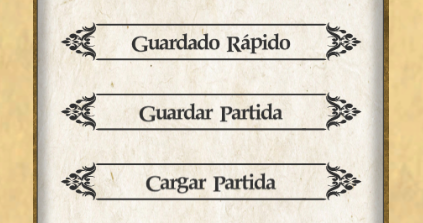
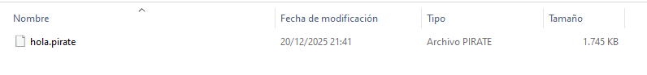

**Versión del juego en la última actualización del documento: v.0386**

# Serialización

La **serialización** de los datos de partida fue introducida desde la versión 0.038 para abarcar progresivamente todos los datos de la partida del jugador, desde el progreso de partida en términos de estado de tripulación, reputación, y cantidad de oro, hasta el estado de las ciudades, personajes y barcos npc.

<p align="center">
  
</p>

## Histórico 
Cambios en la primera fase de la versión 0.038:
- Permitir serializar aspectos clave del juego, en binary y en json.
- Permitir serializar también datos de refugios naturales, puestos de contrabando y escondites de piratas.
- Permitir serializar el avatar y la bandera del jugador en la partida.
- Añadido diccionario de datos de lugares del mundo, que puede ser usado como plantilla para modding y pruebas de serialización.
- Añadidas opciones de "guardado rápido" y "continuar partida".

Cambios de la release 0.0385:
- Además de refugios, se pueden guardar los datos de las ciudades y villas.
- Corrección de errores en serialización y modding.

Cambios en la versión pre-alfa de serialización completa 0.0386
- Se pueden guardar y cargar los datos de personajes (contrabandistas y piratas)
- Añadido botón de Guardado Rápido


## Flujo principal 

### Guardar Partida

Para guardar partida, el jugador debe abrir el menú y pulsar el botón correspondiente. Se podrá elegir entre "Guardado rápido" o pulsar en "Guardar Partida", lo que abrirá el desplegable de partidas guardadas y permitirá introducir el nombre de la nueva partida.

También existirá una función de autoguardado, que se pretende que sea funcional para la release de la versión 0.04.

En todos estos casos, el flujo de operaciones es idéntico: se serializa toda la información de la partida en un objeto de la clase **SavedFile**, y se genera un archivo en binary con una extensión predeterminada.

Para hacer todo esto y dar comienzo al flujo de llamadas entre scripts que permiten guardar una partida, se debe llamar al método **SaveGame** dentro de la clase **GameManager**.

```c#
    public void SaveGame(string fileName)
    {
        var savedGameBinaryFormat = new SavedGameBinaryFormat(new SavedFile());
        savedGameBinaryFormat.SaveGame(fileName);
    }
```

Este método instancia un objeto de la clase **SavedGameBinaryFormat**, que es la clase encargada de generar un archivo con la partida guardada. Para ello, se crea un objeto de la clase **SavedFile**.


```c#
    public class SavedGameBinaryFormat : SerializationUtilities
    {
        public SavedFile savedFile;

        //...

        public void SaveGame(string fileName)
        {
            //Serialización:
            binaryFormatter.Serialize(stream, this.savedFile);
            stream.Close();
        }
    }
```

La clase SavedFile permite crear un objeto que contiene toda la información necesaria de la partida convertida a formato serializable, desde la fecha en el mundo de la partida y los datos del jugador, hasta los datos de las ciudades, personajes y convoyes.

```c#
    [Serializable]
    public class SavedFile : SerializationConverter
    {
        //Datos de partida:
        public DateTime WorldDate; // fecha de la partida
        public uint playedTime; // tiempo de juego en segundos;
        public float deltaWorldDate; // el contador para llegar al próximo día

        //etc...

        //Datos del jugador
        public string
            playerName,
            playerShipName;
        public byte[]
            playerFlag,
            playerAvatar;

        //etc...

        //Datos del mundo
        public SerializableKingdom[] kingdoms;
        public SerializableNaturalPort[] naturalPorts;
        public SerializableSmugglersPost[] hideouts;
        public SerializablePirateShelter[] shelters;

        //etc...

        public SavedFile()
        {
            // Constructor
        }
    }
```

Tras este proceso, se genera un binaryFormatter para serializar el objeto y escribir la  representación binaria en un fileStream ligado a una ruta de guardado (que por defecto será la carpeta /Saves). El resultado será la creación del archivo en la carpeta especificada:

<p align="center">
  
</p>


### Cargar Partida

De manera análoga al proceso de guardado, el GameManager del juego dispone del método **LoadGame**, en el cual se genera una instancia de la clase **GameLoaderBinaryFormat**.

```c#
    public void LoadGame(string fileName)
    {
        var loaderBinaryFormat = new GameLoaderBinaryFormat();
        SavedFile savedGameData = loaderBinaryFormat.LoadGame(fileName);
    }
```
Esta es una de las formas de obtener datos de carga. La otra es hacer sobre el botón "Continuar Partida" para cargar la última partida guardada. Esto da lugar al siguiente flujo de operaciones:
- Se marca una bandera para indicar que vamos a cargar una partida
- Obtenemos la ruta de la partida guardada más reciente
- Se procede a cargar la escena. Al cargar la escena, leemos la bandera, y cargamos los datos de la partida.
  
```c#
    //----------------------------------
    //En el script del botón:
    //----------------------------------
    string directory = GetDirectory();
    var files = new DirectoryInfo(directory).GetFiles("*.*");
    var latestFileName = GetLastGetLatestFile(files);

    PersistentGameSettings.loadingFile = true;
    PersistentGameSettings.selectedFileName = latestFileName;
    SceneManager.SetAsynSceneAndLoadAsyn(3);

    //----------------------------------
    //En el script de carga de escena:
    //----------------------------------
    if (PersistentGameSettings.loadingFile)
    {
        //Load saved file data
        var file = PersistentGameSettings.selectedFileName;
        var fileName = file.Split('.')[0];
        var loaderBinaryFormat = new GameLoaderBinaryFormat();
        SavedFile savedGameData = loaderBinaryFormat.LoadGame(fileName);

        if (savedGameData != null)
        {
            PersistentGameData.getDataFromSavedFile(savedGameData);
        }
        else
        {
            Application.Quit();
        }
    }
    else 
    {
        //cosas...
    }
```

De la misma forma en la que la clase SavedGameBinaryFormat se encarga de crear un objeto serializado y guardar la partida, la clase GameLoaderBinaryFormat se encarga de deserializar los datos, crear un objeto de tipo SavedFile y cargar la partida.

```c#
    [Serializable]
    public class GameLoaderBinaryFormat : SerializationUtilities
    {
        public SavedFile LoadGame(string fileName)
        {
            var path = getRoute() + fileName + getFileExtension();
            Debug.Log(path);
            if (File.Exists(path))
            {
                var binaryFormatter = new BinaryFormatter();
                var stream = new FileStream(path, FileMode.Open);
                SavedFile result = binaryFormatter.Deserialize(stream) as SavedFile;
                stream.Close();
                return result;
            }
            return null;
        }
    }
```

Como resultado de la deserialización de la representación binaria del archivo, obtenemos un objeto de tipo SavedFile que contiene los datos de la partida guardada. Cuando hemos hecho esto, podremos volcar la información de la partida en el juego a partir del método **getDataFromSavedFile**.

```c#
    PersistentGameData.getDataFromSavedFile(savedGameData);
```

Este método establece los valores de varias banderas estáticas que parametrizan los datos del mundo y de la partida, y además se genera un objeto contenedor. Este contenedor tiene la finalidad de ser persistente entre la carga de escenas y hacer una "entrega" (delivery) de datos. Cuando se ha hecho esto, el componente-contenedor se destruye.

```c#
    public static void getDataFromSavedFile(SavedFile savedFile)
    {
        _GData_PlayerName = savedFile.playerName;
        _GData_ShipName = savedFile.playerShipName;

        //etc...

        //Creamos una instancia contenedora de los datos que no se destruya al cargar la escena y permita seguir cargando datos.
        var fileContainer = instance.gameObject.AddComponent<PersistentSavedFileContainer>();
        fileContainer.savedFile = savedFile;
    }
```

Por consiguiente, al cargar un partida, el flujo de ejecución se resume a los siguientes pasos:
- Se busca el archivo específico a través del path
- Deserializamos el archivo, pasando de una representación en binaryFile a un objeto de c# de la clase savedFile.
- Ajustamos las banderas estáticas. Esto implica que algunos valores o aspectos clave de la partida se establecen directamente, pero no todos.
- Como el juego aún no está preparado para instanciar elementos de la escena en función de la información de la partida guardada, generamos un "delivery"
- Cargamos la escena
- Hacemos la entrega, soltando objetos creados durante la escena de carga. 

Este diseño de operaciones mediante el empleo de contenedores-delivery se basa en un uso práctico de los recursos mientras cargamos la partida: si al cargar la escena comenzamos a cargar todo, habrá un tirón en los primeros frames de partida, y no tiene demasiado sentido completar la carga de escena y acto seguido comenzar a modificar la escena cargada. En lugar de ello, creamos y almacenamos durante la carga asíncrona los objetos que vamos a necesitar, tales como ciudades y reinos. Esto supuso un cambio drástico en la arquitectura de datos, pero el resultado es un sistema de guardado y cargado más flexible, ya que el número de ciudades, villas, escondites, reinos, etc es mucho más mutable.

En otras palabras: si en el futuro se pueden arrasar villas, fundar nuevos refugios, o hallar nuevos refugios mediante eventos del juego, el sistema de guardado ya estará preparado.

### Mapas de Campaña

Como se ha descrito anteriormente, al cargar una partida se están soltando o "entregando" objetos persistentes generados durante la ejecución de la escena de carga asíncrona. Los objetos se instancia, se hacen persistentes entre escena, gestionados por un objeto de una clase "delivery" que tiene un "paquete" de datos que entregar, y que una vez ha entregado los objetos, se destruye.

Al hacer esto, se vuelcan a escena objetos sensibles a cambios, a existir o no en el juego, y en definitiva, objetos y datos que definen el último estado de la partida antes de guardar. Estos objetos son los refugios, ciudades, etcétera.

Otros objetos se instancia en escena y son parte fija de la escena, ya que son inertes a la carga de partida. Tales elementos son los poolings de objetos, elemento de interfaz, etcétera.

En realidad, la carga de objetos la estamos haciendo siempre, ya que la escena del juego ya no contiene ciudades, reinos ni refugios desde la incorporación del sistema de serialización y modding. Entonces, al crear una partida nueva, también debemos de "cargar" una partida. Esta partida tiene los datos iniciales del juego por defecto.

Esta partida se encuentra en un archivo denominado **"worldData_Campaign_1720"**. La diferencia al cargar esta "partida" es que los datos iniciales serán siempre los mismos, y que la partida no contiene datos que pueda elegir el jugador al crear partida (como nivel de dificultad, bonificaciones iniciales etc) ni información creada aleatoriamente, como son los barcos, convoyes y personajes generados al crear la nueva partida.

```c#
    //*Ejemplo de cargas en binario y en json
    // ---- BINARY
    var startGameBinaryFormat = new StartGameBinaryFormat(new StartGameData());
    startGameBinaryFormat.WorldData("worldData_Campaign_1720");

    // ---- JSON
    var startGameJSONFormat = new StartGameJSONFormat(new StartGameData());
    startGameJSONFormat.WorldData("worldData_Campaign_1720");
```

```c#
    //Comprobar si esta escena de carga lleva a una escena de partida.
    //Esto ocurrirá si hemos pasado por el menú y obtenido el contenedor persistente
    if (GameObject.FindWithTag("PersistentDataContainer") == null)
      return;

    //cargar los datos de campaña por defecto
    Transform[] containers;
    string fileName = PersistentGameSettings.currentMod != null 
      ? "worldData_Campaign_Mod" 
      : "worldData_Campaign_1720";

    containers = SerializationUtils.LoadCitiesDataJson(fileName);
```


### Conclusiones

Conclusiones de la mecánica del sistema de serialización y guardado:
* Con el nuevo sistema de modding y serializado, se ha reemplazado un sistema rígido de reinos y ciudades en escena por un sistema de ciudades y reinos que son "entregados" a la escena al cargar.
* El sistema de guardado va a permitir que el número de ciudades, villas, refugios etc cambie. Esto también permite mayor libertad al crear mods.
* El serializado se puede realizar en binary en json.

### Otros aspectos

Otro aspecto a destacar es la serialización y deserialización de la bandera avatar del jugador. Al crear una partida, el jugador debe personalizar su bandera mediante una combinación de elementos. Al hacer esto, se rasteriza una imagen completa a mapa de bits para la bandera y otra para el icono-avatar.

Durante el proceso de guardado, los datos de la imagen completa se almacenan en el fichero, para después poder reconstruir la imagen original. Si bien era posible simplificar este paso guardando solamente los índices de los elementos combinados, se decidió almacenar la imagen completa porque de esta manera se podrá guardar cualquier imagen, incluyendo avatares personalizados que el jugador haya cargado directamente de su ordenador y de los cuales sería imposible tener una referencia previa. De este modo, la serialización de la bandera del jugador está preparada a futuro para incluir la opción de cargar una imagen de bandera directamente del ordenador del jugador.

### Extensión

Los archivos de partidas guardadas utilizan por defecto la extensión **".pirate"**. En cambio, al cargar un mod, se puede emplear una extensión personalizada. Si el mod utilizado no tiene ninguna extensión de partida guardada específica, se utilizará la extensión **.mod**.

```c#
public class SerializationUtilities : SerializationConverter
    {
        public string extension = ".pirate";

        protected virtual string getFileExtension()
        {
            var currentMod = PersistentGameSettings.currentMod;

            if (currentMod == null)
            {
                return extension;
            }
            else if (currentMod.gameLogic != null)
            {
                //extensión de partidas guardadas del mod:
                var ext = currentMod.gameLogic.modFileExt;
                return ext != string.Empty ? ext : ".mod";
            }
            else
            {
                return ".mod";
            }
        }
    }
```

## Clases Principales
//todo
## Clase PersistentGameData
//todo

