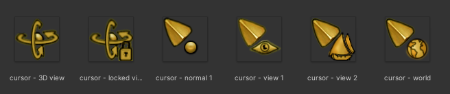
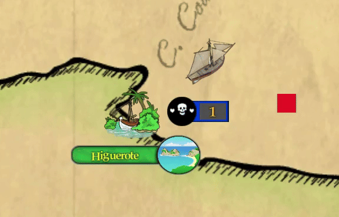

# Cursores del juego

El cursor del juego es un elemento de control y visual que se controla desde el **CursorManager**. Desde la versión 0.038.5, se pueden modificar los sprites del cursor (desde esta misma versión también se oculta el sprite en el splash trailer o escena de logo).

<p align="center">
  
</p>

La gestión del cursor del juego pasa por funcionalidades mecánicas (ocultar el cursor en detemrinadas escenas) y visuales (mostrar un cursor diferente si interactuamos con un elemento) que se manejan a través de varias funciones del script. Un ejemplo sería el cambio del sprite del cursor al ponerlo sobre un embarcación o un convoy, indicando que el objetivo puede ser seleccionado o interceptado.

Para modificar los sprites de un mod, hay que añadir las texturas al directorio **/Data/Cursors/** del mod. Actualmente el juego utiliza hasta seis sprites para modificar el cursor, por lo que si el directorio contiene menos de seis imágenes, se reutilizan los sprites por defecto del juego. Es decir, si la carpeta de imágenes contiene un cursor, se modifica sólo el primer sprite del cursor del juego; si la carpeta contiene dos, se modifican los dos primeros, y así sucesivamente.

```c#

    var mod = PersistentGameSettings.currentMod;
    if (mod != null)
    {
        var modSpritePath = mod.ModPath + "/Data/Cursors/";

        if (Directory.Exists(modSpritePath))
        {
            //Cargamos los sprites del mod
            string[] files = Directory.GetFiles(modSpritePath, "*.png");

            if (files.Length > 1)
            {
                if (files.Length > 6)
                {
                    cursors = new Texture2D[files.Length];
                }
                for (int i = 0; i < files.Length; i++)
                {
                    byte[] fileData = File.ReadAllBytes(files[i]);
                    Texture2D tex = new Texture2D(2, 2);
                    tex.LoadImage(fileData);
                    cursors[i] = tex;
                }
                SetCursor(0);
            }
        }
    }


```

### Ejemplo

En este ejemplo se van a modificar los sprites del cursor del juego creando una carpeta **"Cursors"** dentro del directorio del mod, en la carpeta **"Data"**, y se añaden tres cuadrados de diferentes colores.

<p align="center">
  
</p>

- La imagen 1 corresponderá al cursor por defecto.
- La imagen 2 corresponde al sprite que se usará al pasar el cursor sobre un punto clave del mundo, como una ciudad o un refugio.
- La imagen 3 se usará al poner el cursor sobre una embarcación o un convoy (ya sean patrullas, mercantes, etc).
- Como no se añaden más sprites en este mod, se mantienen los demás sprites por defecto.

<p align="center">
  
</p>
